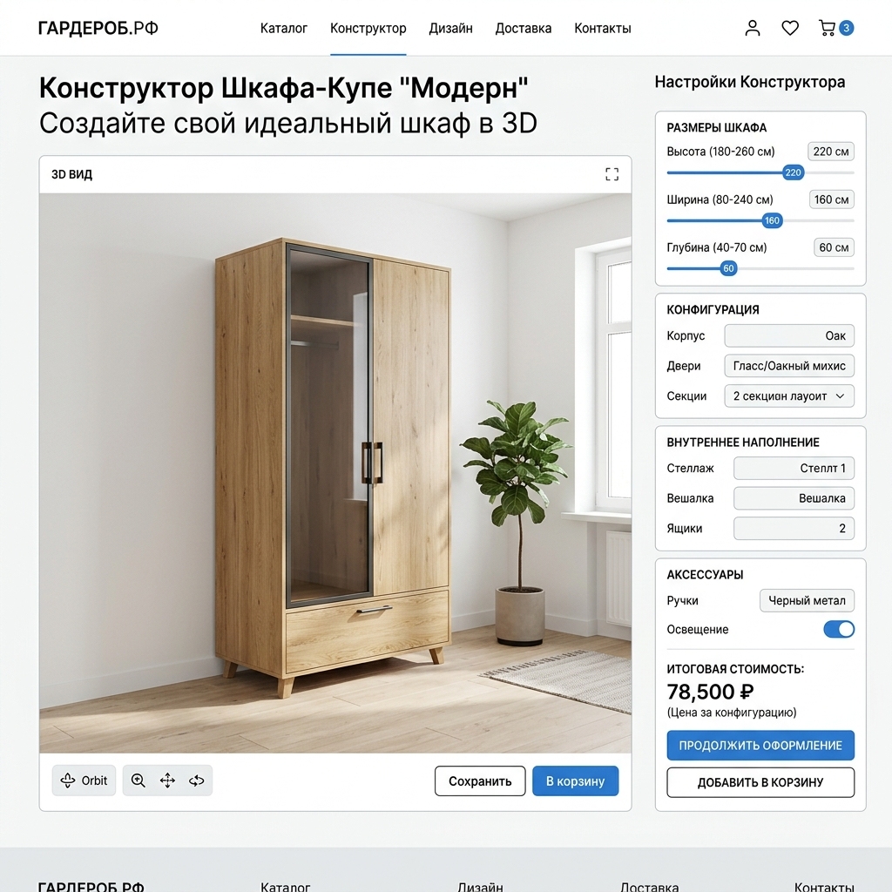
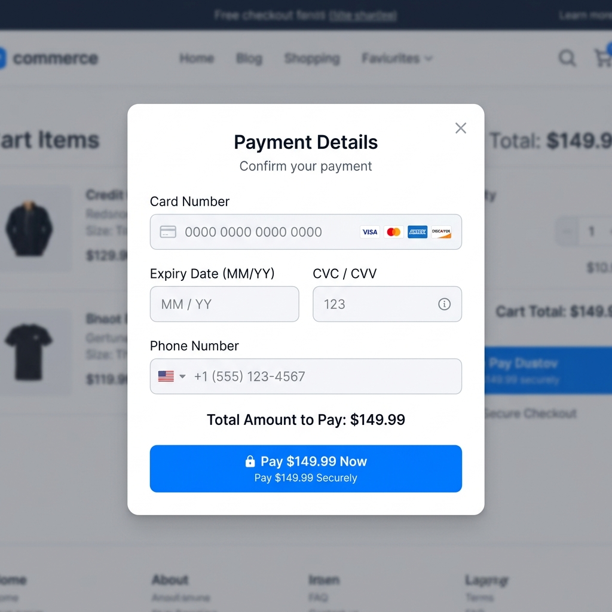
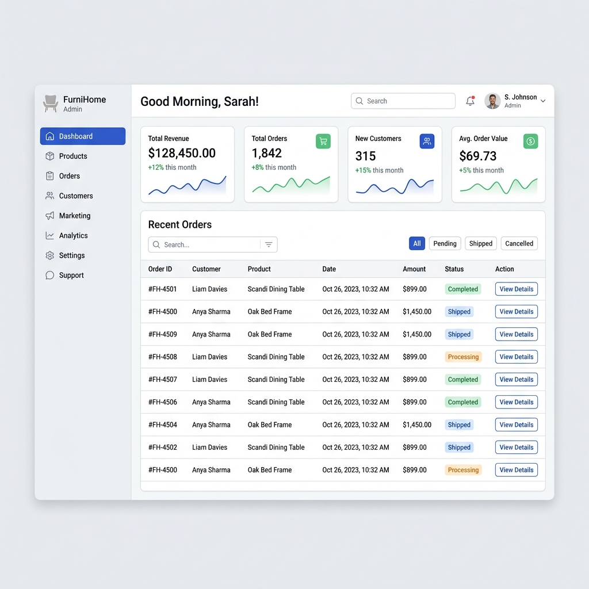

# REMI: Документация и Тест-кейсы

## 1. Обзор проекта
Платформа **REMI** — это онлайн-конструктор корпусной мебели с 3D-визуализацией в реальном времени, встроенной системой онлайн-заказов и распределением ролей пользователей. Дизайн системы выполнен в стиле чистого светлого минимализма для повышения конверсии.

## 2. Скриншоты интерфейса

### Основной экран 3D Конструктора

### Форма оплаты и валидация

### Панель Администратора

## 3. Таблица Тест-кейсов

| ID | Модуль | Описание | Шаги | Ожидаемый результат | Статус |
|---|---|---|---|---|---|
| TC-01 | Конструктор | Изменение размеров шкафа | 1. Открыть конструктор 2. Изменить ширину со 100 на 150 см | 3D-модель мгновенно перестраивается, цена пересчитывается | ✅ Пройден |
| TC-02 | Конструктор | Изменение цвета фасадов | 1. Переключиться на "Материал и цвет" 2. Выбрать новый цвет | Двери шкафа окрашиваются в выбранный цвет, материал визуально изменяется | ✅ Пройден |
| TC-03 | Валидация | Проверка ввода короткого имени | 1. Нажать "В корзину" 2. Ввести имя "А" 3. Нажать "Перейти к оплате" | Возникает ошибка: "Имя слишком короткое" | ✅ Пройден |
| TC-04 | Валидация | Проверка номера телефона | 1. Ввести телефон `12345` 2. Нажать "Перейти к оплате" | Возникает ошибка: "Некорректный формат телефона" | ✅ Пройден |
| TC-05 | Валидация | Проверка адреса доставки | 1. Ввести адрес `Дом 5` 2. Нажать "Перейти к оплате" | Возникает ошибка: "Введите полный адрес (не менее 10 символов)" | ✅ Пройден |
| TC-06 | Оплата | Валидация номера карты | 1. Пройти на шаг 2 (Оплата) 2. Ввести карту `1234 5678` 3. Нажать "Оплатить" | Возникает ошибка: "Номер карты должен состоять из 16 цифр" | ✅ Пройден |
| TC-07 | Оплата | Валидация срока действия | 1. Ввести срок `13/22` 2. Нажать "Оплатить" | Ошибка: "Некорректный срок" или "Карта просрочена" | ✅ Пройден |
| TC-08 | Оформление | Успешный заказ | 1. Заполнить форму валидными данными 2. Нажать "Оплатить" | Имитация оплаты (2 сек), заказ попадает в кабинет, окно успешно закрывается | ✅ Пройден |
| TC-09 | Роли | Доступ Администратора | 1. Войти как `admin` / `123` 2. Перейти в "Кабинет" | Открывается админ-панель со статистикой и общим списком заявок | ✅ Пройден |

## 4. Памятка по ролям
> **Примечание:** Авторизация в системе обязательна для совершения заказов и сохранения проектов.

- **admin / 123**: Полный доступ к статистике, управлению каталогом и контролю всех пользователей.
- **support / 123**: Работа с обращениями и отзывами клиентов. Отправка ответных сообщений.
- **delivery / 123**: Кабинет курьера. Взятие заказа в работу и перевод статуса в "Доставлено".
- **user / 123**: Базовый профиль для покупок. Хранит историю заказов клиента.
