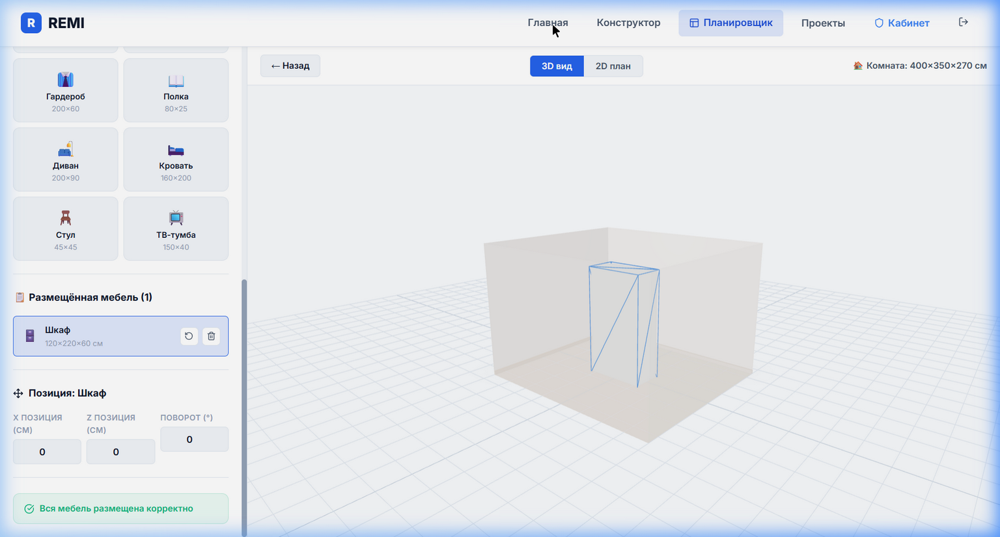
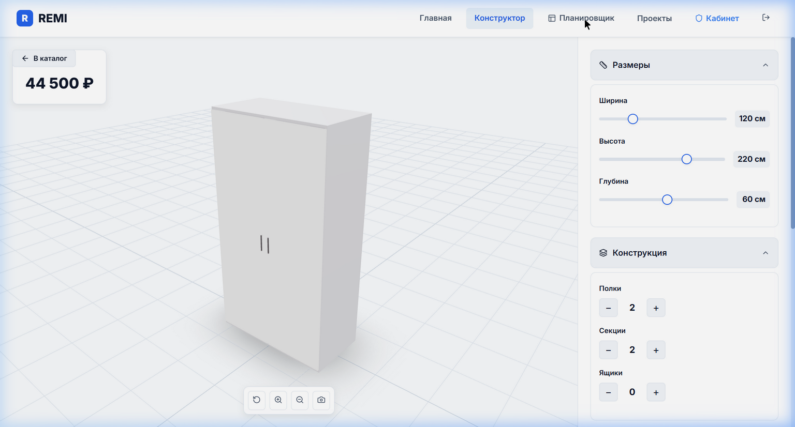
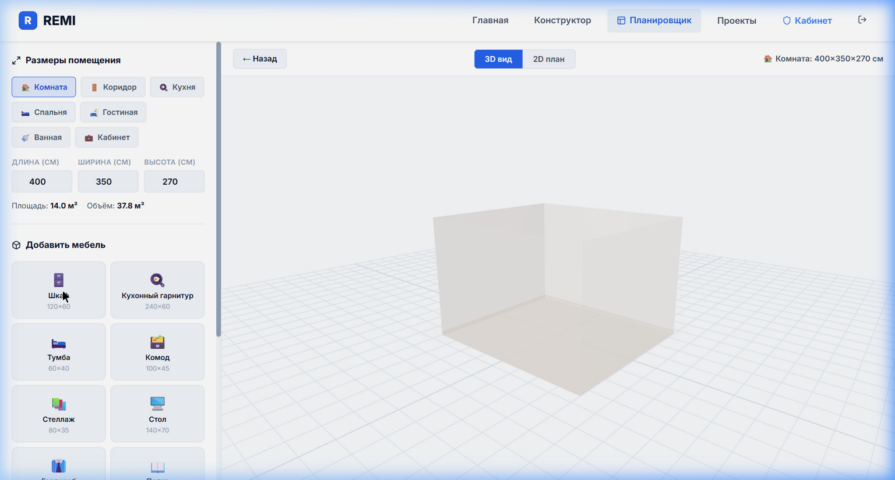
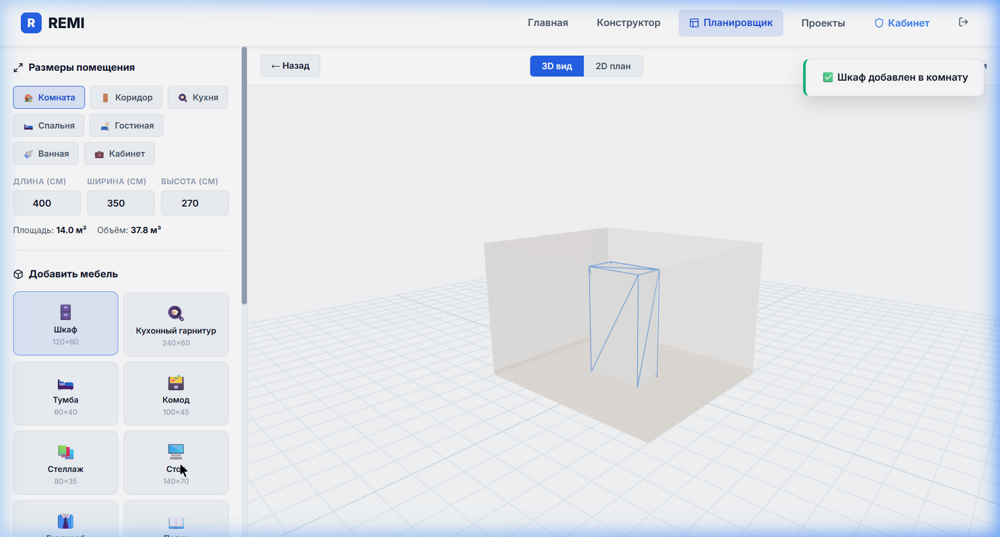
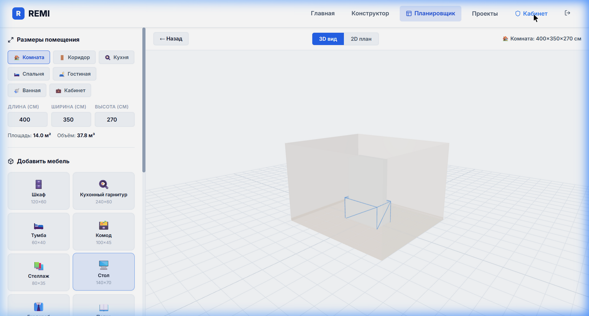
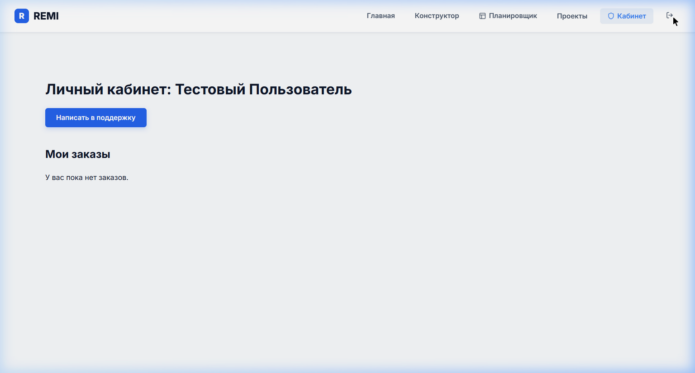
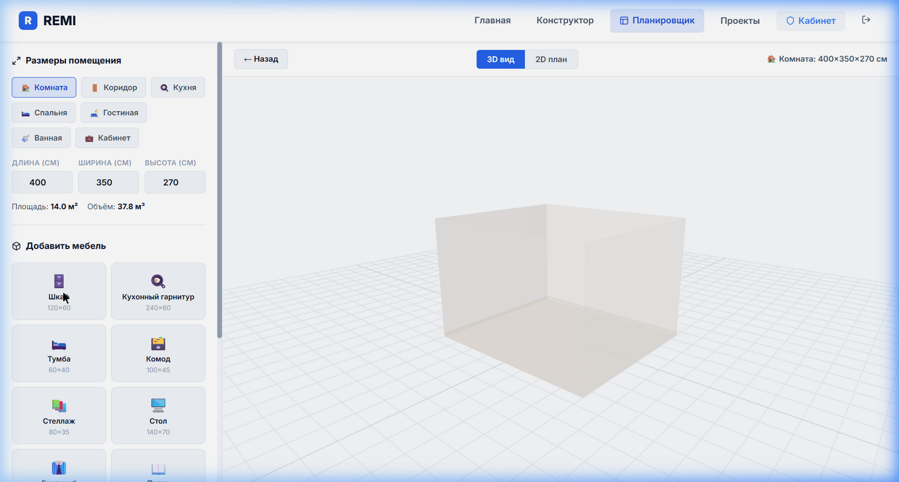

<p align="center">
  
</p>

<h1 align="center">🪑 REMI — 3D Конструктор и Планировщик Мебели</h1>

<p align="center">
  <strong>Онлайн-платформа для проектирования мебели и планировки помещений с 3D-визуализацией</strong>
</p>

<p align="center">
  
  
  
</p>

---

## 📋 Содержание

- [О проекте](#-о-проекте)
- [Демо](#-демо)
- [Скриншоты](#-скриншоты)
- [Возможности](#-возможности)
- [Технологии](#-технологии)
- [Архитектура](#-архитектура)
- [Установка и запуск](#-установка-и-запуск)
- [Структура проекта](#-структура-проекта)
- [Планировщик комнат](#-планировщик-комнат)
- [3D-конструктор мебели](#-3d-конструктор-мебели)
- [Система ролей](#-система-ролей)
- [Тестирование](#-тестирование)

---

## 🎯 О проекте

**REMI** — это комплексное веб-приложение для мебельной компании, объединяющее:
- **3D-конструктор мебели** с настройкой размеров, материалов и цветов
- **Планировщик помещений** с размещением мебели в 3D-комнате
- **Систему заказов** с оплатой и доставкой
- **Мульти-ролевую авторизацию** (Админ, Поддержка, Доставка, Пользователь)

| Проблема | Решение REMI |
|---|---|
| Клиент не может представить мебель | 3D-визуализация в реальном времени |
| Сложно подобрать мебель под комнату | Планировщик с проверкой размеров |
| Долгий расчёт стоимости | Автоматический расчёт при изменении |
| Нет обратной связи | Отзывы + чат с поддержкой |

---

## 🌐 Демо

🔗 **Живая версия:** [remi-furniture-app.surge.sh](http://remi-furniture-app.surge.sh)

---

## 📸 Скриншоты

### Главная страница
Стартовая страница с hero-секцией, описанием возможностей и каталогом мебели.


### Возможности конструктора
Секция с карточками возможностей: 3D визуализация, точные размеры, кастомизация, расчёт стоимости.



### 3D-конструктор мебели
Интерактивная 3D-модель мебели с боковой панелью настроек размеров, материалов и цветов.


### Планировщик помещений (пустая комната)
Новая функция — задание размеров комнаты и 3D-визуализация помещения.



### Планировщик с мебелью
Размещение шкафа в комнате с отображением позиции и валидацией размеров.



### Планировщик — несколько предметов
Добавление нескольких предметов мебели одновременно (шкаф + стол).



### Личный кабинет пользователя
Панель пользователя с историей заказов и связью с поддержкой.



### Страница авторизации
Форма входа с возможностью регистрации нового аккаунта.



### Админ-панель
Панель администратора после входа в систему.


### 3D-визуализация комнаты
Детальная 3D-визуализация комнаты с полом, стенами и сеткой.



---

## ✨ Возможности

### 🏠 Планировщик помещений (НОВОЕ)

- **7 типов помещений**: Комната, Коридор, Кухня, Спальня, Гостиная, Ванная, Кабинет
- **Задание размеров**: длина, ширина, высота (100–2000 см)
- **12 типов мебели** для размещения: шкаф, стол, диван, кровать и т.д.
- **3D-визуализация комнаты** со стенами и полом
- **2D-план** с drag-and-drop перемещением мебели
- **Валидация размеров**: мебель не может быть больше комнаты
- **Позиционирование**: координаты X/Z и поворот для каждого предмета

### 🎨 3D-конструктор мебели

- **8 типов мебели**: шкаф, кухня, тумба, комод, стеллаж, стол, гардероб, полка
- **Настройка размеров**: ширина 30–400 см, высота 20–300 см, глубина 15–100 см
- **5 материалов**: ЛДСП, МДФ, дерево, стекло, металл
- **16 цветов**: 8 для корпуса + 8 для фасадов
- **Конструкция**: полки (0–8), секции (1–6), ящики (0–6)
- **Двери**: распашные, раздвижные, без дверей
- **Фурнитура**: 4 типа ручек + 4 типа ножек

### 💰 Автоматический расчёт стоимости

```
Итого = Базовая цена × Материал + Полки + Секции + Ящики + Двери + Ручки + Ножки
```

### 💾 Сохранение и экспорт

- Сохранение проектов в localStorage
- Экспорт PNG-скриншота
- Генерация PDF-документа
- QR-код проекта

### 👥 Мульти-ролевая система

| Роль | Возможности |
|------|------------|
| Администратор | Заказы, статистика, каталог, пользователи |
| Поддержка | Ответы на обращения, управление отзывами |
| Доставка | Обработка заказов, смена статусов |
| Пользователь | Конструктор, заказы, отзывы, поддержка |

---

## 🛠️ Технологии

| Технология | Версия | Назначение |
|-----------|--------|------------|
| **React** | 19.1 | UI-фреймворк |
| **Three.js** | 0.184 | 3D-движок |
| **React Three Fiber** | 9.x | React-обёртка для Three.js |
| **React Three Drei** | 10.x | 3D-компоненты |
| **Vite** | 8.x | Сборщик |
| **Lucide React** | 1.x | Иконки |
| **jsPDF** | 4.x | Генерация PDF |
| **QRCode React** | 4.x | QR-коды |

---

## 🏗️ Архитектура

```
┌───────────────────────────────────────────────────┐
│                    App.jsx                         │
│  ┌──────────┬──────────┬───────────┬────────────┐ │
│  │ HomePage │Construct.│  Room     │ Dashboard  │ │
│  │          │  Page    │ Planner   │ (4 roles)  │ │
│  │ • Hero   │ ┌──────┐ │ • Room3D │ • Admin    │ │
│  │ • Feats  │ │Sidebar│ │ • 2DPlan│ • User     │ │
│  │ • Catalog│ │ Size  │ │ • Items │ • Support  │ │
│  │ • Review │ │ Mater.│ │ • Valid.│ • Delivery │ │
│  │ • Footer │ │ Color │ │         │            │ │
│  │          │ │ Price │ │         │            │ │
│  │          │ └──────┘ │         │            │ │
│  │          │ ┌──────┐ │         │            │ │
│  │          │ │ 3D   │ │         │            │ │
│  │          │ │Viewer│ │         │            │ │
│  │          │ └──────┘ │         │            │ │
│  └──────────┴──────────┴───────────┴────────────┘ │
│  ┌────────────────────────────────────────┐        │
│  │ Modals: Auth/Order/QR/Projects/Support│        │
│  └────────────────────────────────────────┘        │
│  ┌──────────────┐ ┌────────┐ ┌────────┐           │
│  │ Toast System │ │ data.js│ │  db.js │           │
│  └──────────────┘ └────────┘ └────────┘           │
└───────────────────────────────────────────────────┘
```

---

## 🚀 Установка и запуск

### Требования

- **Node.js** 18+ (рекомендуется 20+)
- **npm** 9+
- Браузер с WebGL (Chrome, Firefox, Edge, Safari)

### Шаги

```bash
# 1. Клонируйте репозиторий
git clone https://github.com/valtureso788/Remi.git
cd Remi

# 2. Установите зависимости
npm install

# 3. Запустите dev-сервер
npm run dev

# 4. Откройте в браузере
# http://localhost:3000
```

### Сборка и деплой

```bash
# Сборка
npm run build

# Деплой на Surge
npx surge ./dist remi-furniture-app.surge.sh
```

---

## 📁 Структура проекта

```
Remi/
├── public/
│   └── favicon.svg                 # Иконка сайта
├── src/
│   ├── App.jsx                     # Главный компонент (роутинг, модалки)
│   ├── ConstructorSidebar.jsx      # Панель настроек конструктора
│   ├── FurnitureViewer.jsx         # 3D-визуализация мебели
│   ├── RoomPlanner.jsx             # Планировщик помещений (НОВОЕ)
│   ├── data.js                     # Каталог, расчёт цен, константы
│   ├── db.js                       # localStorage база данных
│   ├── index.css                   # Дизайн-система и стили
│   └── main.jsx                    # Точка входа React
├── docs/                           # Скриншоты для документации
├── index.html                      # HTML с SEO мета-тегами
├── vite.config.js                  # Конфигурация Vite
├── package.json                    # Зависимости
├── ПользователиПароли              # Учётные записи
└── README.md                       # Документация
```

---

## 🏠 Планировщик комнат

### Как работает

1. Выберите тип помещения (комната, кухня, спальня и т.д.)
2. Задайте размеры: длина, ширина, высота
3. Добавьте мебель из каталога (12 типов)
4. Расположите мебель в комнате (3D или 2D вид)
5. Система автоматически проверяет, помещается ли мебель

### Валидация размеров

Система не позволит добавить мебель, которая:
- **Шире** комнаты (ширина мебели > длина/ширина комнаты)
- **Выше** потолка (высота мебели > высота комнаты)
- **Выходит за границы** при перемещении (красная подсветка)

---

## 🧊 3D-конструктор мебели

### Технические детали

- **Движок**: Three.js через React Three Fiber
- **Освещение**: ambient + 2 directional + point (accent)
- **Тени**: ContactShadows
- **Окружение**: City preset
- **Камера**: PerspectiveCamera (FOV 45°)
- **Управление**: OrbitControls (вращение/зум/пан)

---

## 🔐 Система ролей

| Логин | Пароль | Роль | Доступ |
|-------|--------|------|--------|
| admin | 123 | Администратор | Заказы, статистика, каталог, пользователи |
| support | 123 | Поддержка | Обращения, отзывы |
| delivery | 123 | Доставка | Заказы на доставку |
| user | 123 | Пользователь | Конструктор, планировщик, заказы |

---

## 🧪 Тестирование

### Тест-кейсы

| # | Тест | Ожидаемый результат | Статус |
|---|------|---------------------|--------|
| 1 | Авторизация admin/123 | Успешный вход, доступ к админ-панели | ✅ |
| 2 | Авторизация user/123 | Успешный вход, доступ к конструктору | ✅ |
| 3 | Регистрация нового пользователя | Создание аккаунта, вход в систему | ✅ |
| 4 | Неверный пароль | Сообщение об ошибке | ✅ |
| 5 | Открытие конструктора (Шкаф) | 3D-модель шкафа отображается | ✅ |
| 6 | Изменение размеров мебели | 3D-модель обновляется в реальном времени | ✅ |
| 7 | Смена материала (Стекло) | Прозрачность модели изменяется | ✅ |
| 8 | Открытие планировщика | 3D-комната отображается | ✅ |
| 9 | Добавление мебели в комнату | Мебель появляется в 3D-сцене | ✅ |
| 10 | Добавление слишком большой мебели | Ошибка: «мебель не помещается» | ✅ |
| 11 | Перемещение мебели за границы | Красная подсветка + предупреждение | ✅ |
| 12 | Переключение 3D/2D в планировщике | Вид переключается корректно | ✅ |
| 13 | Сохранение проекта | Проект сохраняется в localStorage | ✅ |
| 14 | Экспорт PNG | Скриншот скачивается | ✅ |
| 15 | Оформление заказа (валидация) | Обязательные поля проверяются | ✅ |
| 16 | Оплата (невалидная карта) | Ошибки валидации отображаются | ✅ |
| 17 | Отправка отзыва | Отзыв сохраняется и отображается | ✅ |

### Скриншоты тестирования

#### Тест 1: Авторизация


#### Тест 5: 3D-конструктор мебели


#### Тест 8: Планировщик комнат


#### Тест 9: Добавление мебели


#### Тест 11: Валидация позиции


---

<p align="center">
  <strong>Разработано для мебельной компании REMI</strong><br/>
  <sub>© 2026 REMI Furniture. Все права защищены.</sub>
</p>
